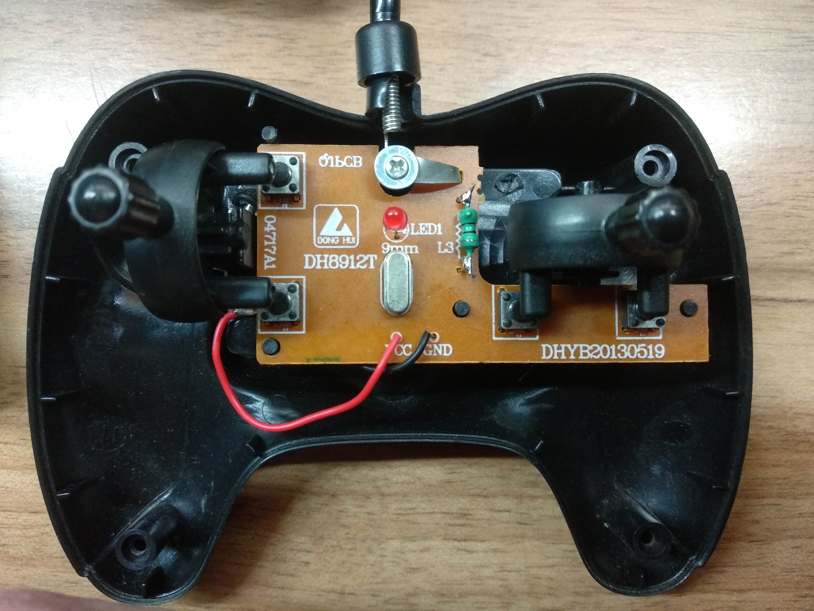
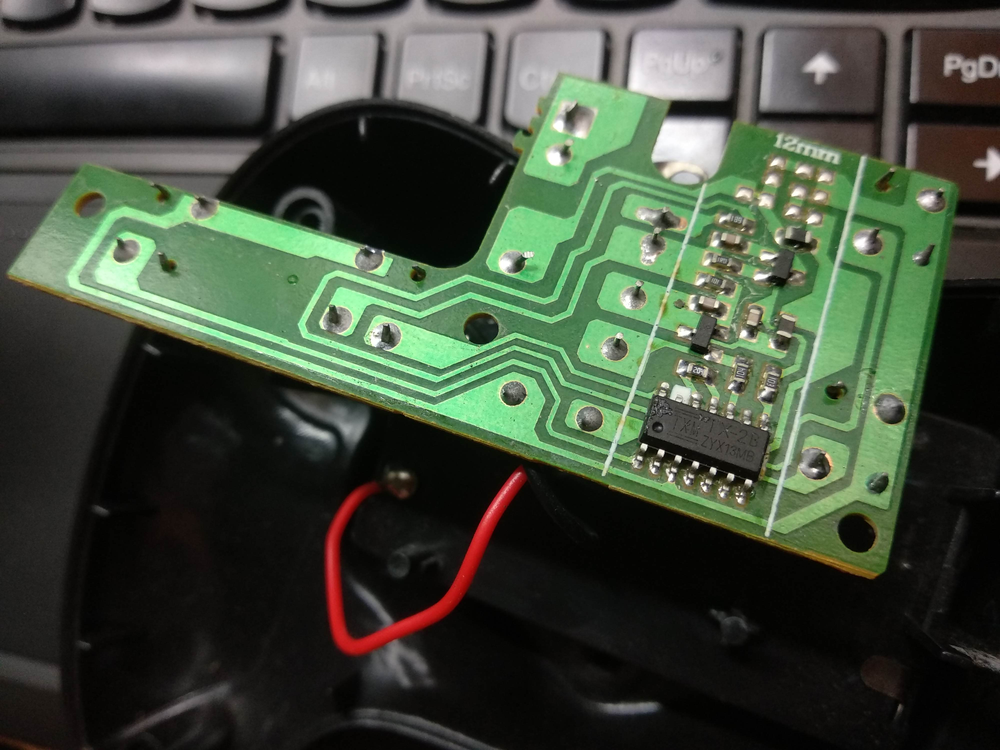
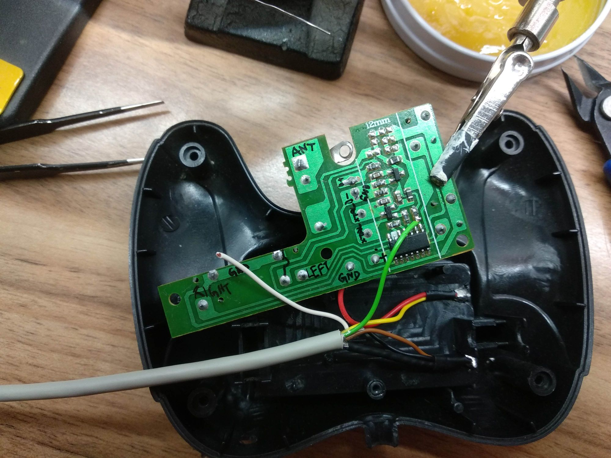
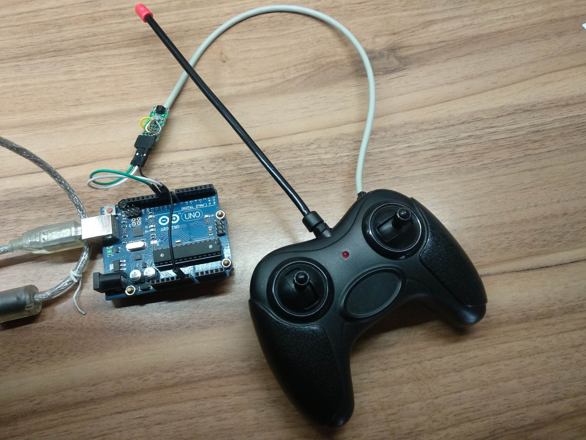
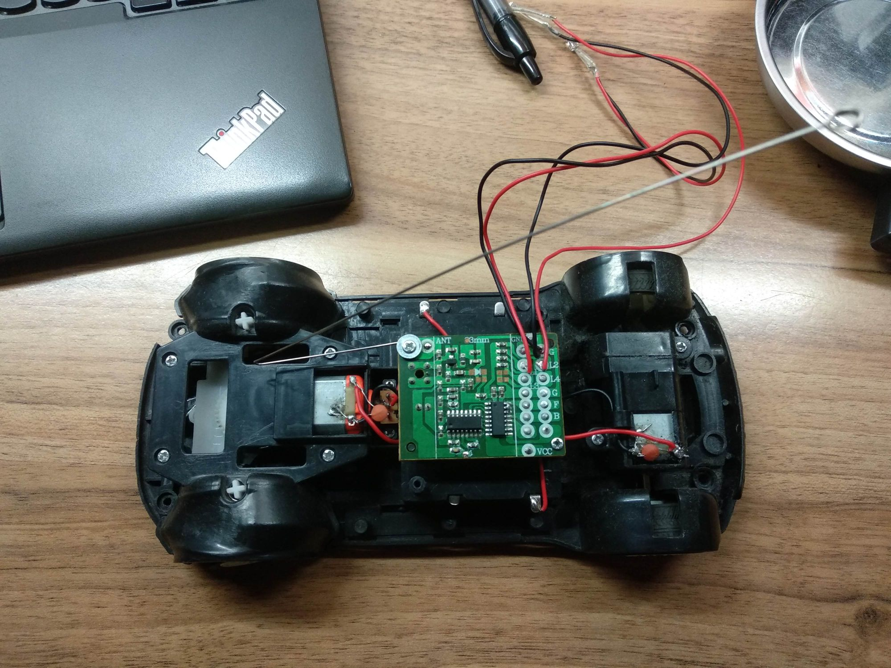
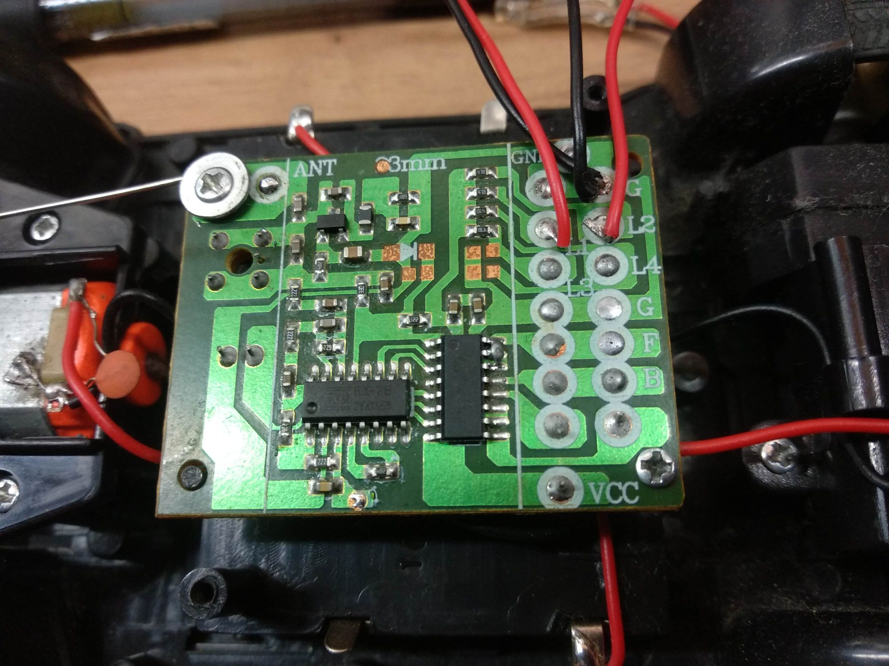

# Rx2Tx2CarRemote
Control cheap toy remote cars by hijacking the car's remote control and sending control codes to the car's receiver using Arduino.


## Installation

This is an Arduino library. Copy it to your Arduino's libraries folder (mine is at `C:\app\electro\Arduino\libraries`). Also you will need to change the `platform.txt` file (mine is located at `C:\app\electro\Arduino\hardware\arduino\avr\platform.txt`) in order to force Arduino IDE to use `c++17` standard by modifying the line where `compiler.cpp.flags` are defined. Change `-std=gnu++11` to `-std=gnu++17`. The line in my `platform.txt` now reads

```
compiler.cpp.flags=-c -g -Os {compiler.warning_flags} -std=gnu++17 -fpermissive -fno-exceptions -ffunction-sections -fdata-sections -fno-threadsafe-statics -Wno-error=narrowing -MMD -flto
```


## Hardware Modification

Open up your car's remote control to see what chip is being used. Mine reads TXM RX-2B YZX13E8 for the reciever (inside the car) and TXM TX-2B YZX13MB for the transmitter (inside the remote control).

## Transmitter
 

You will need to bring out three signals: GND, SO (Signal Out - PIN 8) and PC (Power Control - PIN 10). You can also bring out the Vdd so you can power the remote control from Arduino, but then you have to be careful not to leave batteries in the remote. I used a shielded cable to prevent electromagnetic interference (connect the shielding to GND).



Two digital pins are used for sending codes. Set PC (Power Control - PIN 10) high and then pulse SO (Signal Out - PIN 8) with encoded 1kHz signal to send a command to the receiver. Possible commands are: `FORWARD, FORWARD_TURBO, TURBO, FORWARD_LEFT, FORWARD_RIGHT, BACKWARD, BACKWARD_RIGHT, BACKWARD_LEFT` and `LEFT`. It is unfortunate that the commands are binary -- they are either on or off, there is no way to throttle. 



## Receiver
 

From the Silan Semiconductors TX-2B/RX-2B [datasheet](datasheet/TX-2B.pdf):

### REMOTE CONTROLLER WITH FIVE FUNCTIONS 

#### DESCRIPTION
The TX-2B/RX-2B is a pair of CMOS LSIs designed for remote controlled car applications. The TX-2B/RX-2B has five control keys for controlling the motions (i.e. forward, backward, rightward, leftward and the turbo function) of the remote controlled car.

#### FEATURES
- Wide operating voltage range (VCC=1.5~5.0V)
- Low stand-by current
- Auto-power-off function for TX-2B
- Few external components are needed


## Captured Traces

Forward


Forward (signal timing)


Forward (ENDCODE timing)


Backward


Left


Right


## Resources
- There is a similar project at https://github.com/dimircea/RX2-TX2-RC

