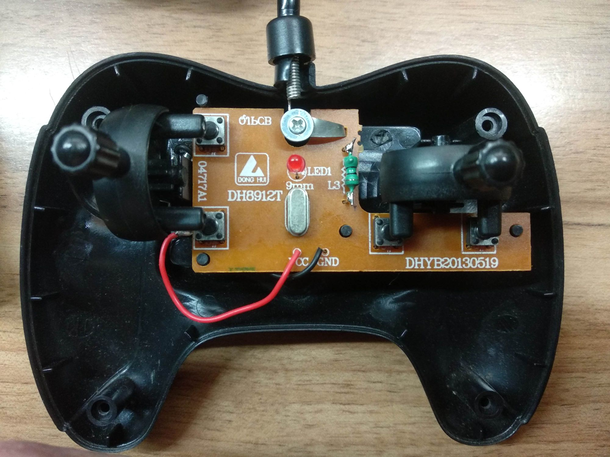

# Rx2Tx2CarRemote
Control cheap toy remote cars by hijacking the car's transmitter and sending control codes to the car's receiver using Arduino.

Based on the Silan Semiconductors TX-2B/RX-2B datasheet. Open up your remote car's transmitter to see what chip is being used. Mine reads TXM RX-2B YZX13E8 for the reciever (inside the car) and TXM TX-2B YZX13MB for the transmitter (inside the remote control).

## Transmitter

## Receiver

From the [datasheet](datasheet/TX-2B.pdf):

### REMOTE CONTROLLER WITH FIVE FUNCTIONS 

#### DESCRIPTION
The TX-2B/RX-2B is a pair of CMOS LSIs designed for remote controlled car applications. The TX-2B/RX-2B has five control keys for controlling the motions (i.e. forward, backward, rightward, leftward and the turbo function) of the remote controlled car.

#### FEATURES
- Wide operating voltage range (VCC=1.5~5.0V)
- Low stand-by current
- Auto-power-off function for TX-2B
- Few external components are needed

There is a similar project at https://github.com/dimircea/RX2-TX2-RC

